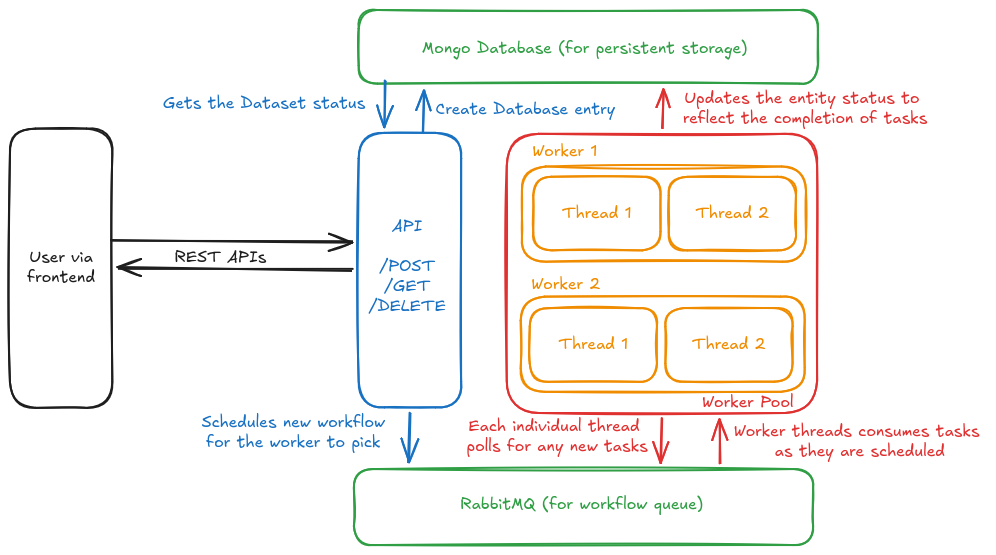

# Data Processing Web System

[](https://github.com/alphaNewrex/data-processing-web-system/actions/workflows/ci.yml)

A web-based system that accepts JSON dataset uploads, processes them asynchronously through a multi-stage pipeline, and displays results in a real-time UI.

**[Watch the demo video](https://drive.google.com/file/d/1iJbxtfFmDhMeNvGZ88MzVoZfejPw-eLt/view?usp=sharing)**

## Quick Start

```bash
docker compose up --build -d
```

Open **http://localhost:3000** in your browser.

That's it — all 6 services (frontend, API, 2 workers, RabbitMQ, MongoDB) start automatically.

## Architecture



### Design Choices

**Two-service backend (FastAPI + Celery):**
The API server handles HTTP requests asynchronously, while Celery workers execute the CPU-bound processing pipeline in separate processes. This separation ensures uploads remain fast even when workers are busy with long-running computations.

> Note: We use PyMongo throughout — `AsyncMongoClient` for non-blocking operations in the FastAPI async endpoints, and `MongoClient` (sync) in Celery workers.

**Three-stage pipeline (preprocess → compute → summarise):**
Rather than a single monolithic task, processing is split into a Celery chain of 3 stages (Only done to demonstrate the concurrency of the workers better). Each stage updates the dataset status in MongoDB, giving the UI granular progress visibility. The stages are:
- **Preprocess** — validates records, separates valid from invalid
- **Compute** — builds category summary, calculates average value (with simulated delay)
- **Summarise** — assembles final output, persists result

**RabbitMQ as broker:**
RabbitMQ provides proper message acknowledgment semantics. Combined with `acks_late=True` and `reject_on_worker_lost=True`, if a worker crashes mid-task, the message is automatically re-delivered to another worker. This ensures no dataset gets "stuck" in an incomplete state due to worker failure.

**MongoDB for persistence:**
Dataset entities are stored as documents in MongoDB, which naturally maps to the nested result structure (category_summary, etc.). PyMongo `AsyncMongoClient` is used in FastAPI to avoid blocking the event loop, while `MongoClient` (sync) is used in Celery workers since tasks are synchronous by nature. One library, two clients.

**MinIO (S3-compatible) for payload storage:**
Only the `dataset_id` (a short string) travels through the Celery broker — the actual record payloads are written to and read from MinIO at every stage boundary. On upload, the raw JSON is stored at `datasets/{id}/raw.json`; each pipeline stage then reads its input and writes its output (`preprocessed.json` → `computed.json` → `result.json`) under the same prefix. This keeps RabbitMQ messages tiny (sidestepping the 128 MB default message limit), makes every stage individually replayable from its input artifact, and leaves Mongo storing only metadata. The same `boto3` code works against MinIO locally and AWS S3 in production with only an endpoint-URL change.

**Dataset entity as source of truth:**
Instead of relying on Celery's `AsyncResult` for status, each dataset has a dedicated MongoDB document tracking its lifecycle (`QUEUED → PREPROCESSING → COMPUTING → SUMMARISING → COMPLETED/FAILED`). This decouples status tracking from the broker and survives restarts and failures.
This model brings in consistency and a single source of truth for the REST consumers and can poll to check the status of the task being run.

**Two worker containers with concurrency=2:**
This gives 4 concurrent task slots, demonstrating that the system handles multiple datasets submitted in quick succession. Tasks exceeding capacity are queued in RabbitMQ and processed as workers become available.

### Crash Recovery

If a worker dies mid-processing:
1. `acks_late=True` — the task message isn't acknowledged until completion
2. `reject_on_worker_lost=True` — RabbitMQ re-queues the message
3. Another worker picks it up and re-processes from the beginning of that chain step
4. Writing results to MongoDB by `dataset_id` is naturally idempotent

> **Demo:** Run `docker compose stop worker-1` while tasks are processing, then watch `worker-2` complete them.

## API Endpoints

| Method | Endpoint | Description |
|--------|----------|-------------|
| `POST` | `/api/dataset` | Upload a JSON file (multipart/form-data) |
| `GET` | `/api/datasets` | List all datasets with status |
| `GET` | `/api/dataset/{id}` | Get single dataset status + result |
| `DELETE` | `/api/dataset/{id}` | Delete a dataset |
| `DELETE` | `/api/datasets` | Delete all datasets |

API docs available at **http://localhost:8000/docs** (Swagger UI).

## Project Structure

```
├── backend/
│   ├── api/
│   │   ├── main.py              # FastAPI app, CORS, lifespan
│   │   ├── routes.py            # REST endpoints
│   │   ├── schemas.py           # Pydantic response models
│   │   └── async_store.py       # PyMongo Async MongoDB operations
│   ├── workers/
│   │   ├── celery_app.py        # Celery config (acks_late, prefetch)
│   │   ├── tasks.py             # 3-stage pipeline tasks
│   │   └── workflow.py          # Pipeline chain definition
│   ├── common/
│   │   ├── config.py            # Environment-based settings
│   │   ├── models.py            # DatasetEntity + status enum
│   │   └── store.py             # PyMongo (sync) store for workers
│   ├── tests/
│   │   └── test_e2e.py          # 27 tests (validation, pipeline, API, edge cases)
│   ├── Dockerfile
│   └── requirements.txt
├── frontend/
│   ├── src/
│   │   ├── App.tsx              # Two-pane layout
│   │   ├── components/
│   │   │   ├── ActionsPane.tsx   # Drag-and-drop file upload
│   │   │   └── TaskCard.tsx      # Dataset status card with progress
│   │   ├── hooks/useTasks.ts    # 2s polling for live updates
│   │   ├── lib/api.ts           # API client
│   │   └── types.ts             # TypeScript interfaces
│   ├── Dockerfile
│   └── nginx.conf
├── sample_data/                  # Test datasets for various scenarios
├── docker-compose.yml            # All 6 services
├── concurrent_upload.sh          # Bulk upload script for concurrency testing
└── README.md
```

## Running Tests

```bash
docker compose exec api pip install pytest httpx
docker compose exec api bash -c "PYTHONPATH=. pytest tests/ -v"
```

## Tech Stack

- **Backend:** Python 3.12, FastAPI, Celery, PyMongo (sync + async)
- **Frontend:** React, TypeScript, Vite, Tailwind CSS, Shadcn UI
- **Infrastructure:** RabbitMQ, MongoDB, Docker Compose, Nginx
